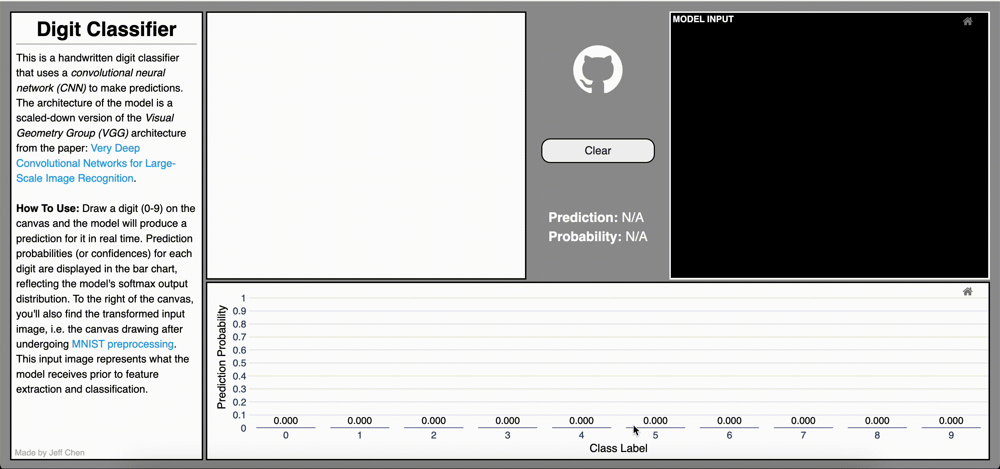

# Digit Classifier 
This is a handwritten digit classifier using a scaled-down **VGG (TinyVGG)** model. The model is trained on images from the MNIST dataset. The web framework for the web application is [Panel](https://panel.holoviz.org/).


## Recommended Installation Instructions
#### 1) Create a New Python Environment
This environment should use **Python >= 3.10**.
#### 2) Clone the ```digit-classifier-app``` Repo
Navigate to your desired parent directory and clone the repository:
```
git clone https://github.com/Jechen00/digit-classifier-app.git
```
#### 3) Install Packages
In the digit-classifier-app repository run one of the following:
```
# For pip:
pip install -r requirements.txt

# For conda/mamba:
conda install -y -c conda-forge --file requirements.txt
```
Alternatively, the packages can be installed manually like so:
```
pip install numpy==2.2.4
pip install matplotlib==3.10.1
pip install panel==1.4.5
pip install param==2.1.1
pip install plotly==6.0.1
pip install torch==2.6.0
pip install torchvision==0.21.0
```

## Running the Application
In the digit-classifier-app repository, the web application can be ran locally with
```
panel serve app.py --port=66
```
The web application will be lauched at ```http://localhost:66/app```.

## VGG Reference Links:
- [Very Deep Convolutional Networks for Large-Scale Image Recognition](https://arxiv.org/pdf/1409.1556)
- [Networks Using Blocks (VGG)](https://d2l.ai/chapter_convolutional-modern/vgg.html)
- [CNN Explainer](https://poloclub.github.io/cnn-explainer/)
